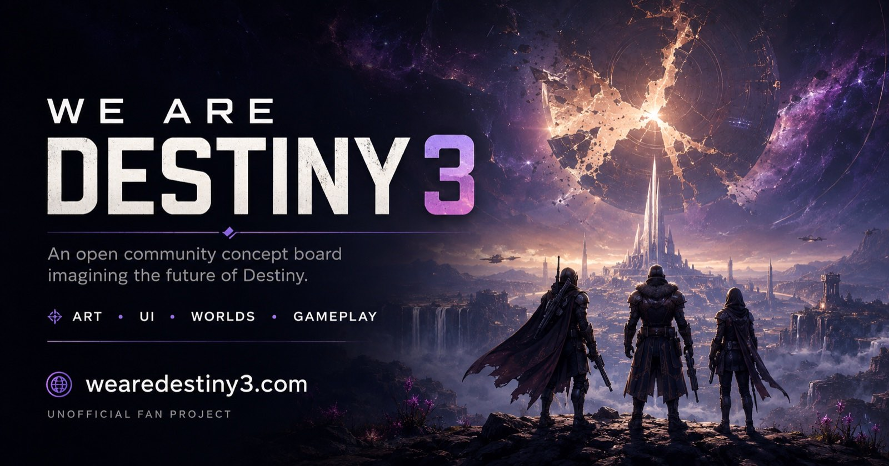

<p align="center">
  <a href="https://wearedestiny3.com">
    
  </a>
</p>

<p align="center">
  <a href="https://wearedestiny3.com"><strong>wearedestiny3.com</strong></a>
  &nbsp;&middot;&nbsp;
  <a href="https://wearedestiny3.com/contribute/">Publish a concept</a>
  &nbsp;&middot;&nbsp;
  <a href="https://wearedestiny3.com/about/">About</a>
  &nbsp;&middot;&nbsp;
  <a href="./CONTRIBUTING.md">Contributing</a>
</p>

<p align="center">
  <em>An open community concept board imagining the future of Destiny.<br>
  Unofficial fan project — not affiliated with Bungie.</em>
</p>

---

**What should Destiny 3 be?**

WE ARE DESTINY 3 is an open community concept project exploring what the next generation of Destiny could look, feel, and play like.

This is not a leak.
This is not an attempt to predict what Bungie is building.

It's a blank canvas.

**Worlds. Weapons. UI. Systems. Guardians. Enemies. Abilities. Music. Lore. Gameplay.**

If you have an idea for Destiny 3, make it.

→ **[Explore wearedestiny3.com](https://wearedestiny3.com)**
→ **[Publish a Concept](https://wearedestiny3.com/contribute/)**

**Everything happens on the site.** Concepts are posted at
[wearedestiny3.com/contribute](https://wearedestiny3.com/contribute/) — no GitHub account, no Git, no JSON.
This repository is where the site is stored, reviewed and deployed from.

---

## The Idea

Destiny has one of the most recognizable visual and gameplay identities in games.

But what does the next major evolution look like?

Not just higher-resolution environments or another subclass.

What does a Destiny built as a truly next-generation game look like?

How should the HUD evolve?

What could a new destination feel like?

What happens to supers?

Weapons?

Fireteams?

Raids?

Social spaces?

Character customization?

Exploration?

The goal of this project is to explore those questions **visually and collaboratively**.

There is no single WE ARE DESTINY 3 vision.

The board is the vision.

---

## A Concept Is an Idea, Not a Medium

The fundamental object on this site is a **Concept**. It can be a written design proposal, a lore entry, a diagram, a render, a video, a prototype, or any combination.

Media is one way to communicate an idea — never the idea itself. A lore post is not a gallery item with a missing thumbnail; it gets its own editorial treatment, and sits on the board beside a render as an equal.

Each concept carries a **type**, so different kinds of contribution don't pretend to be the same thing:

| Type | For |
|---|---|
| `vision` | Broad high-level direction |
| `design` | A mechanic, system or gameplay idea |
| `lore` | Narrative and worldbuilding |
| `world` | A destination or environment |
| `visual` | Art, UI or animation exploration |
| `prototype` | An interactive or playable experiment |

Vision, Design and Lore concepts require a written proposal. The build refuses to publish one without it.

---

## One Idea = One Entry

**If you make five videos exploring the same combat scenario, that is one concept with five explorations — not five cards.**

```
Super Activation Redesign          ← the board shows this
├── Selected direction             ← your strongest piece
├── Key takeaways                  ← what the concept argues for
├── Selected moments               ← the seconds worth keeping
└── Explorations                   ← every attempt, annotated
    ├── 01  HUD transition         ✓ HUD collapse    ✕ the Super itself
    ├── 02  Weapon transformation  ✓ weapon dissolve ✕ pacing
    └── 03  Activation and camera  ✓ camera movement
```

That distinction matters most for generative work, where nothing comes out perfect. One generation has the best HUD, another has the best weapon effect, a third accidentally discovers something you weren't aiming for. As five separate posts, that reads as noise. As one concept with the good seconds pulled out of each, it reads as design research — which is what it actually is.

**Explorations, not versions.** `v1, v2, v3` implies each is better than the last. Exploration 01 might hold the only usable HUD in the set while 04 holds the only usable lighting. Each is labelled by what it was *testing*.

**Status, not quality.** Every concept is `Exploring`, `Direction`, or `Refined` — how settled the idea is, not how good it is. Starting at Exploring is normal; most concepts never leave it.

---

## Cite, Don't Duplicate

The second rule the project is built around, and probably the most important mechanic on the site.

**Don't copy an idea into yours to include it. Reference it, build on it, and credit the person who made it.**

Concepts cite each other as structured data, not URLs pasted into a paragraph:

```json
"connections": [
  { "rel": "builds-on", "concept": "super-activation-exploration",
    "note": "The weapon transformation here is close to how I imagine entering the state." },
  { "rel": "references", "concept": "super-activation-exploration",
    "exploration": "exploration-03", "t": [4, 8] },
  { "rel": "alternative-to", "concept": "one-shot-supers" }
]
```

Six relationship types, chosen by the person citing:

| `rel` | Means | Their page shows |
|---|---|---|
| `builds-on` | Extending the original idea | Built on by |
| `inspired-by` | Broad creative influence | Inspired |
| `references` | Using it as supporting material | Referenced by |
| `pairs-with` | Designed to work alongside it | Pairs with |
| `alternative-to` | Proposing another approach | Alternative proposed by |
| `challenges` | Intentionally arguing against it | Challenged by |

Because it's structured, **the reverse relationship is derived**. Cite someone and their page gains *"Referenced by 7 concepts"* — nobody maintains that by hand. It's a dependency graph for game ideas.

**You can cite four seconds instead of a whole concept.** Point at an exploration and a time range, and that clip embeds in your page captioned *from Super Activation Exploration by @colbymaloy · Exploration 03*. Attribution is generated, never typed — you cannot cite someone without crediting them, and you don't need permission to reference published work.

**Concepts are allowed to disagree.** Someone proposes the Traveler should die; someone else proposes it should awaken. Both belong, linked as alternatives. There is no canonical WE ARE DESTINY 3.

---

## Open Questions

Somewhere for an idea to live before it's developed enough to be a concept.

```
QUESTION      "What should Supers become?"
     ↓
CONCEPTS      design proposals · lore · renders · prototypes
     ↓
DIRECTIONS    the ones other people start building on
```

A concept links to one with a single field, and the question page collects every answer. Answers don't have to agree. A question with no answers isn't a failure state — it's the invitation.

---

## Create Anything

Use whatever medium you want.

* Concept art
* Gameplay concepts
* UI / UX
* Weapons
* Armor
* Guardians
* Abilities and supers
* Subclasses
* Worlds and destinations
* Enemies
* Vehicles
* Raids and activities
* Social systems
* Progression systems
* Lore
* Music and sound
* Animation
* 3D renders
* Videos
* Interactive prototypes
* Game design documents
* Sketches
* Mods and playable experiments

Use Photoshop.

Use Blender.

Use Unreal.

Use Figma.

Draw it by hand.

Write it.

Code it.

Generate it with AI.

Combine all of them.

**The tool doesn't matter. The idea does.**

---

## Posting a Concept

**[wearedestiny3.com/contribute](https://wearedestiny3.com/contribute/)**

Sign in once, fill in the form, attach whatever communicates the idea. The form asks for the idea, its type, the proposal, and every exploration underneath it — including the ones that didn't work, marked for what to keep and what to drop.

You don't need a GitHub account. You don't need Git. There is no JSON to write.

A person reviews every submission before it appears on the board.

[`CONTRIBUTING.md`](./CONTRIBUTING.md) is for people working on the site itself.

---

## Some Starting Questions

Don't know what to make?

Try answering one question.

**What should firing a weapon feel like in Destiny 3?**

**What should replacing the current ability HUD look like?**

**What does the next evolution of a Super look like?**

**What destination couldn't have existed in Destiny 2?**

**How should a fireteam interact outside combat?**

**What would make exploration meaningful?**

**What does a next-generation raid encounter look like?**

**How should armor customization evolve?**

**What should the Tower become?**

Then show us your answer.

---

## Principles

### Evolve, don't just reskin

Destiny already has incredible art direction.

The interesting question is where it goes next.

### Ideas over tools

Traditional artist, designer, developer, filmmaker, musician, AI creator — everyone is welcome.

### Show, don't just tell

Whenever possible, visualize the idea.

### Explain the thinking

A good concept isn't only beautiful.

Tell us what problem you're solving or what experience you're trying to create.

### Keep the failures

The generation that only got one thing right still got one thing right. Annotate it and keep it.

### Remix ideas

One person's HUD concept might inspire another person's gameplay video.

Someone else's destination could inspire a raid concept.

Build on each other.

That's the point.

---

## How This Is Built

Everything runs on GitHub. No server, no database, no third-party hosting anywhere in the stack.

| Layer | What does it |
|---|---|
| **Submission** | [wearedestiny3.com/contribute](https://wearedestiny3.com/contribute/) — the only route in |
| **Review** | A pull request the maintainer merges. Nothing reaches `main` unreviewed |
| **Database** | One folder per concept: `concepts/<slug>/concept.json` |
| **Media CDN** | GitHub user-attachments and [Releases](../../releases) |
| **Frontend** | Static HTML/CSS/JS in [`src/`](./src/), rendered to `_site/` at deploy |
| **Deploys** | GitHub Actions → GitHub Pages → [wearedestiny3.com](https://wearedestiny3.com) |

### Repository

```
WeAreDestiny3/
├── concepts/                one folder per concept — the database
│   ├── _example/            annotated reference (skipped by the build)
│   └── <slug>/concept.json
├── questions/               open questions, same shape
│   └── <slug>/question.json
├── shared/model.mjs         the vocabulary — types, categories, relations, validation
├── src/                     the site
│   ├── index.html           the board
│   ├── publish/             on-site submission form
│   ├── about/  contribute/  404.html
│   ├── assets/              site.css, board.js, concept.js, publish.js
│   └── _templates/          head, topbar, footer, concept page, question page
├── functions/               Cloud Function that turns a submission into a PR
├── media/                   thumbnails, small images, branding
├── CNAME                    wearedestiny3.com
└── .github/
    ├── scripts/             build.mjs, validate.mjs, preflight.mjs
    └── workflows/           validate on PR, build and deploy on merge
```

`shared/model.mjs` is the single definition of what a valid concept is. The static build, the publish form in the browser, and the Cloud Function all import it, so none of them can drift apart.

### Publishing from the site

`/contribute/` signs someone in, validates against the same rules the build enforces, moves their media onto a GitHub Release, and opens a pull request. **Nothing is written to `main`** — merging the PR is what publishes the concept, and the PR runs the full validation first.

That pull request is the maintainer's review queue, not a contribution route. Contributors never see it.

Setup: [`docs/PUBLISHING.md`](./docs/PUBLISHING.md).

### Why the concepts are plain text files

The board can't quietly rewrite anyone's work, the whole history is auditable, and if this project ever stops being maintained the concepts are still sitting in the open rather than trapped in a database nobody can reach.

Concept pages are rendered to real static HTML at deploy time, so every concept has its own URL, its own share preview, and works before any JavaScript runs. Contributors still only write JSON.

### Where media lives

Committed to the repo: thumbnails, small images, and site assets, under [`media/`](./media/).

Hosted by GitHub, referenced by URL: everything else. Drag a file into an Issue or pull request and GitHub gives it a permanent `user-attachments` link — images and GIFs up to 10 MB, video up to 10 MB on Free plans or 100 MB on paid, in MP4, MOV or WEBM. Anything larger goes on a [Release](../../releases), where a single asset can be 2 GB with no total size or bandwidth cap.

**No video files are ever committed.** Git LFS doesn't work with GitHub Pages, so it solves nothing here, and the published site is capped at 1 GB with a 100 GB/month soft bandwidth limit. The build rejects committed video outright.

### Running it locally

```sh
node .github/scripts/build.mjs
python3 -m http.server 8000 --directory _site
# http://localhost:8000
```

No dependencies — plain Node and any static server.

---

## Attribution

Creators should always be credited for their work.

If you build directly on another community concept, credit and link to the original creator.

Do not submit work you don't have the right to share.

By contributing media to this repository, you acknowledge that it may be displayed publicly as part of the WE ARE DESTINY 3 project.

You keep the rights to your own work. Full terms in [`LICENSE`](./LICENSE); how people treat each other here in [`CODE_OF_CONDUCT.md`](./CODE_OF_CONDUCT.md).

---

## This Is a Fan Project

WE ARE DESTINY 3 is an unofficial community fan project.

It is not affiliated with, endorsed by, sponsored by, or associated with Bungie.

Destiny and related names, characters, imagery, and trademarks belong to their respective owners.

Community submissions represent concepts created by their individual contributors.

---

## One Question

**If the community got to design Destiny 3, what would we make?**

Let's find out.
